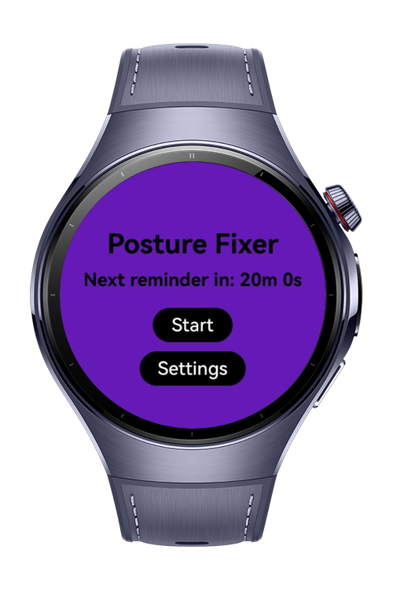
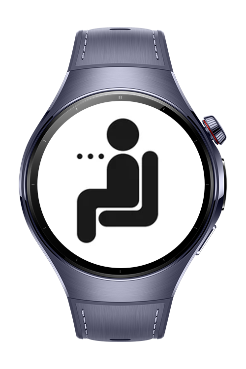

> **Note:** To access all shared projects, get information about environment setup, and view other guides, please visit [Explore-In-HMOS-Wearable Index](https://github.com/Explore-In-HMOS-Wearable/hmos-index).

# Posture Fixer

A wearable application designed to help users improve their posture by reminding them to maintain correct posture at regular intervals. The app uses timers to notify users when it's time to check and correct their posture, accompanied by visual cues (e.g., a picture of correct posture) and vibrations to reinforce the reminders.

# Preview

<div>
  
  
</div>

# Use Cases

**1. Interval-Based Reminders**

Allows users to set time intervals for posture reminders, ensuring they check and adjust their posture throughout the day.

**2. Visual Posture Cues**

Displays an image of correct posture when a reminder goes off, helping users visualize the ideal posture.

**3. Vibration Alerts**
Provides a vibration notification when the reminder interval is up, prompting the user to adjust their posture.


# Tech Stack

* **Languages:** ArkTS, ArkUI
* **Frameworks:** HarmonyOS SDK 6.0.0
* **Tools:** DevEco Studio 6.0.0
* **Libraries:** @kit.ArkTs, @kit.SensorServiceKit

# Constraints and Restrictions

## Supported Device

* Huawei Watch 5

# Directory Structure

```
/entry/src/main
├───ets       
│   └───pages
|           settingsData.ets
|           IntervalSelector.ets
│           SettingsPage.ets
│           Index.ets
└───resources
    └───base
        └───profile
                router_map.json
 ```

# LICENSE

**Posture Fixer App** is distributed under the terms of the MIT License.
See the [LICENSE](/LICENSE) for more information.
